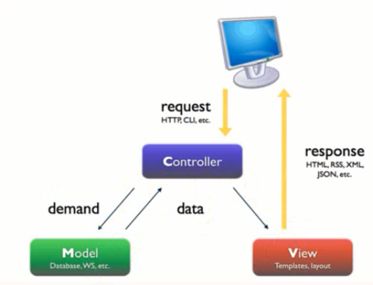

[TOC]

# 1.Django简介

[Django官网](https://www.djangoproject.com/)

Django发布于2005年7月，是当前Python世界里最有名且成熟的网络框架。 最初是被开发用于管理劳伦斯出版集团旗下的以新闻内容为主的网站的，即CMS(内容管理系统)软件。

Django是一个用Python编写的开放源代码的Web应用框架，代码是开源的。此系统采用了MVC的框架模式, 也可以称为MTV模式

## 1.1 MVC模式简介

MVC全名是Model View Controller，是模型(model)－视图(view)－控制器(controller)的缩写，一种软件设计典范，用一种业务逻辑、数据、界面显示分离的方法组织代码，将业务逻辑聚集到一个部件里面，在改进和个性化定制界面及用户交互的同时，不需要重新编写业务逻辑。MVC被独特的发展起来用于映射传统的输入、处理和输出功能在一个逻辑的图形化用户界面的结构中。 通俗的来讲就是，强制性的使应用程序的输入，处理和输出分开。

核心思想：解耦

优点：减低各个模块之间的耦合性，方便变更，更容易重构代码，最大程度的实现了代码的重用

MVC(Model, View, Controller) Model: 即数据存取层。用于封装于应用程序的业务逻辑相关的数据，以及对数据的处理。说白了就是模型对象负责在数据库中存取数据

View: 即表现层。负责数据的显示和呈现。渲染的html页面给用户，或者返回数据给用户。

Controller: 即业务逻辑层。负责从用户端收集用户的输入，进行业务逻辑处理，包括向模型中发送数据，进行CRUD操作。

图解： 

浏览器中MVC的表现形式图解:
 

## MTV简介

严格来说，Django的模式应该是MVT模式，本质上和MVC没什么区别，也是各组件之间为了保持松耦合关系，只是定义上有些许不同。

Model： 负责业务与数据库(ORM)的对象

View： 负责业务逻辑并适当调用Model和Template

Template: 负责把页面渲染展示给用户

注意： Django中还有一个url分发器，也叫作路由。主要用于将url请求发送给不同的View处理，View在进行相关的业务逻辑处理。

# 2.virtualenv虚拟环境的搭建

## 2.1 安装virtualenv

	pip install virtualenv

## 2.2 创建虚拟环境并安装Django的依赖库

	virtualenv --no-site-packages 虚拟环境的名字
运行效果:

	F:\Python\env>virtualenv --no-site-packages firstdjango
	Using base prefix 'f:\\python36'
	New python executable in F:\Python\env\firstdjango\Scripts\python.exe
	Installing setuptools, pip, wheel...done.

	F:\Python\env>

之后进入虚拟环境后安装django，在这里我们使用的是Django1.11.1版本
	
	F:\Python\env>cd firstdjango
	
	F:\Python\env\firstdjango>cd Scripts
	
	F:\Python\env\firstdjango\Scripts>activate
	
	(firstdjango) F:\Python\env\firstdjango\Scripts>

	(firstdjango) F:\Python\env\firstdjango\Scripts>pip install django==1.11.1
	Collecting django==1.11.1
	  Using cached https://files.pythonhosted.org/packages/2b/2c/019d6d5f7ed2889082ed96f849bf462c57265087a3a568a19b0d4c53bc55/Django-1.11.1-py2.py3-none-any.whl
	Collecting pytz (from django==1.11.1)
	  Using cached https://files.pythonhosted.org/packages/dc/83/15f7833b70d3e067ca91467ca245bae0f6fe56ddc7451aa0dc5606b120f2/pytz-2018.4-py2.py3-none-any.whl
	Installing collected packages: pytz, django
	Successfully installed django-1.11.1 pytz-2018.4
	
	(firstdjango) F:\Python\env\firstdjango\Scripts>

创建第一个Django项目:
	
	(firstdjango) F:\Python\env\workspace>django-admin startproject blogdjango
	
	(firstdjango) F:\Python\env\workspace>

# 3. 第一个Django项目的创建与简单配置

## 3.1 配置项目所需的虚拟环境

进入pycharm, 打开刚才创建的Django项目,点击底部的Terminal, 如图：

会发现此时该项目对应的虚拟环境不是刚刚所创建的虚拟环境，或者并未进入虚拟环境。

此时可以一次点击菜单栏 file/setting/project:(项目名字)(注意:直接双击)/Project Interpreter/

如上图，我的项目此时所对应的虚拟环境，并不是我所想要的那个虚拟环境,可以点击图中的选择框，选择对应的虚拟环境，若选择框中，并没有对应的，则需要重新添加

点击步骤1.的设置按钮，选择Add进入步骤2.的页面，选择Existing enviroment选择虚拟环境的路径。

注：如果进行上述的操作后，Terminal所显示的虚拟环境还不是想要对应的虚拟环境， 请自己手动跳转

## 3.2 配置debug

依次点击 run/debug/edit co.../

## 3.3 登录第一个页面

- 创建新的app

	python manage.py startapp App

- 给app添加一个urls.py文件来管理路由并配置好这个app

  * 在settings里面进行如下配置:

	INSTALLED_APPS = [
	    'django.contrib.admin',
	    'django.contrib.auth',
	    'django.contrib.contenttypes',
	    'django.contrib.sessions',
	    'django.contrib.messages',
	    'django.contrib.staticfiles',
	    'App'  # 添加app
	]

  *	给App创建一个urls.py管理路由
	 
	from django.conf.urls import url
	
	
	urlpatterns = [
	
	]

  * 将App的路由包括到总路由中:
 
	from django.conf.urls import url, include
	from django.contrib import admin
	
	urlpatterns = [
	    url(r'^admin/', admin.site.urls),
	    url(r'^app/', include('App.urls'))
	]

- 进入第一个页面

App/views.py：

	def index(request):
	    return HttpResponse('这是首页！')

App/urls.py：

	from django.conf.urls import url
	
	from App import views
	
	urlpatterns = [
	    url('index/', views.index)
	]

运行, 进入localhost:8081/app/index/

