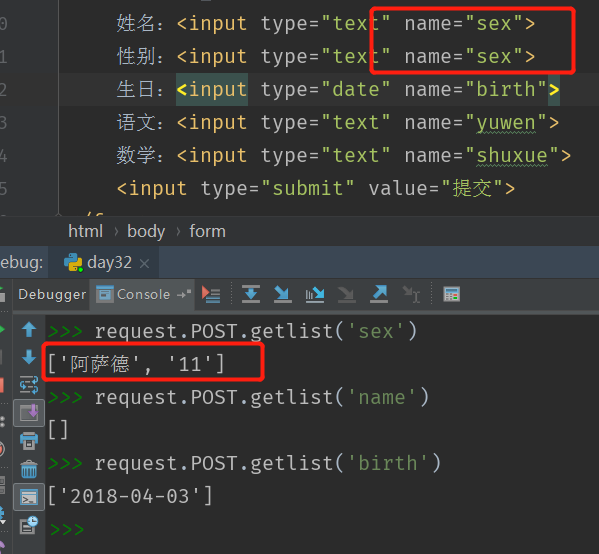

[TOC]

# 1. 路由与反向解析

## 1.1 前言
MVT模式中的V，V代表视图，在Django中的视图主要用来接受web请求，并做出响应。视图的本质就是一个python中的函数 视图的响应分为两大类 以json数据形式返回 以网页的形式返回 重定向到另一个网页 错误视图页面（404,500等） 视图响应的过程：浏览器输入 → django获取信息并去掉ip：端口，身下路径 → urls路由匹配 → 视图响应 → 回馈到浏览器

## 1.2 url配置
	
	settings中制定根级url配置文件，对应的属性ROOT_URLCONF
注：这一部分在前面讲解模型的时候已经用到过了，在setting里面的urls.py中将你创建的app包括进去

### (1 urlpatterns

	一个url实例的对象，全在根配置搞定
    内部由url组成（正则匹配路径）
    url(r‘^learn/’, views.learn)

### (2 导入其他的url配置

在应用中创建urls.py 文件，编写配置规则，在工程urls.py中进行
导入包含

    From django.conf.urls import include
    urlpatterns = [url(r’^xxx/’, include(‘app.urls’))]

注意：
url配置正则注意事项：
  正则匹配时从上到下进行遍历，匹配到就不会继续向后查找了
  匹配的正则前方不需要加反斜杠
  正则钱需要加（r）表示字符串不转义

## 1.3 获取url路径的参数
### (1 url传递一个参数

如果需要从url中获取一个值，需要对正则加小括号

	url(r‘^grade/(\d+)$’, views.getStudent)
注意，url匹配中添加了()取参，在请求调用的函数中必须接收 

	def getStudent(request, classid)

### (2 url传递多个参数
如果需要获取url路径中的多个参数，那就添加多个括号，默认按照顺序匹配路径名字，参数顺序必须固定
定义url中传递三个参数的地址：

    url(r‘^news/(\d{4})/(\d)+/(\d+)$’, views.getNews)
    
实现方法：匹配年月日 

	def getNews(requests, year, month, day)

### (3 使用关键词获取参数

参数也可以使用关键字参数形式,参数顺序可以任意 
	
	url(r’news/(?P\d{4})/(?P\d)+/(?P\d+)$’, views.getNews)

## 1.3 反向解析

### (1 在模板中进行反向解析
这一步骤将会在django模板中介绍 

### (2 在views中使用反向解析
使用反向解析优点 如果在视图中，模板中使用硬编码连接，在url配置发生改变时，需要变更的代码会非常多，这样导致我们的代码结构不是很容易维护，使用反向解析可以提高我们代码的扩展性和可维护性

 	HttpResponseRedirect(reverse(namespace:name, kwargs = {key1 : value1, key2 : value2}))
kwargs 是字典,使用这种方式进行反向解析，kwargs的key值需要在配置和配置路由时设置的关键字一致

或者也可以使用args=(id,)元祖的方式传递参数,通过这种方式，可以不用设置路由关键词。

## 1.4 视图
### (1 错误视图
位置：通常在应用下的views.py中定义 错误视图： 404视图（页面没有被找到 page not found） 400视图（客户端操作错误 bad request） 403视图（权限错误 403 forbidden ） 500视图（服务器内部错误 server error）

### (2 自定义错误视图
#### a. 修改debug模式
在工程的settings中修改debug模式： 注意： 需要在debug=False的情况下才可以 没有关闭debug的情况下会在界面中直接显示错误的信息 

#### b. 在templates文件中定义自己的错误样式

## 1.5 请求与响应
### (1 HttpRequest定义

	服务器在接收到http请求后，会根据报文创建HttpRequest对象
	视图中第一个参数就是HttpRequest对象
	Django框架会进行自己的包装，之后传递给视图
	属性：
	    path        请求的完整路径
	    method   请求的方法，通常get，post
	    Encoding 编码方式，常用utf-8
	    Get          类似字典的参数，包含了get的所有参数
	    post	       类似字典的参数，包含了post的所有参数
	    Files         类似字典的参数，包含了上传的文件
	    Cookies    字典，包含了所有的COOKIES
	    Session    类似字典，表示会话
	    方法： is_ajax()   判断是否是ajax()，通常在移动端和js中
### (2 响应QueryDict类型

	 1）类似字典的结构数据，与字典的区别，可以存在相同的键
	    2）GET和POST都是QueryDict对象
	    3）QueryDict中数据获取方式
	        dict[‘name’] 或者dict.get(‘name’)
	        获取指定key对应的所有值
	        dict.getlist(‘name’)

如下，获取重复提交数据的方法：

### (3 响应

	1）可以直接返回一个HttpResponse对象：
	    服务器返回给客户端的数据，HttpResponse由程序员自己创建
	    不使用模板，直接HttpResponse()
	2）可以返回模板
	调用模板，进行渲染，直接使用render一步到位
	返回表达式：
	    render(request, template_name, context)
	        request  请求体对象
	        template_name  模板路径
	        context  字典参数，用来填坑
	
	3）属性
	    Content   返回的内容
	    Charset   编码格式
	    status_code  响应状态码（200,4xx,5xx）
	        4xx 客户端的错误
	        5xx 服务端的错误
	    content_type   MIME类型，定义传输类型的，比如有xml，html，png等等，比如content_type=’image/jpg’
	4）方法
	    init    初始化内容
	    write(xxx) 直接写到文本
	    flush 冲刷缓冲区
	    set_cookie(key, value=’’, max_age=None, exprise=None)
	    delete_cookie(key)   删除cookie，上面是设置
	4）重定向
	    HttpResponseRedirect响应重定向：可以实现服务器内部的跳转
	    Return HttpResponseRedirect(‘/xxx/xxx’)
	    使用的时候推荐使用反向解析
	    JsonResponse
	    使用json数据的请求，通常用在异步请求上jsonResponse(dict)
	    content_type是application/json
# 2. Django模板

在使用模板之前，首先先配置一下templates和static
	
templates

	TEMPLATES = [
	    {
	        'BACKEND': 'django.template.backends.django.DjangoTemplates',
	        'DIRS': [os.path.join(BASE_DIR, 'templates')],
	        'APP_DIRS': True,
	        'OPTIONS': {
	            'context_processors': [
	                'django.template.context_processors.debug',
	                'django.template.context_processors.request',
	                'django.contrib.auth.context_processors.auth',
	                'django.contrib.messages.context_processors.messages',
	            ],
	        },
	    },
	]

static

	STATIC_URL = '/static/'
	STATICFILES_DIRS = (
	    os.path.join(BASE_DIR, 'static'),
	)

模板的作用有很多，最重要的一点是可以减少页面的重复率，我们可以把网页共有的css， js， 头部， 尾部全部写到基础模板中(base.html)

base.html:

	<title>

    </title>
    

    

index.html:

	 <!--继承模板--!>

	
    	博客主页
	

	
	    <link href="/static/css/base.css" rel="stylesheet">
	    <link href="/static/css/index.css" rel="stylesheet">
	    <link href="/static/css/m.css" rel="stylesheet">
	

django模板中还自带了实现数据显示的方法

	# 后台传输业务请求
	return render("request", "template.html", {"k1": "v1", "k2": [11, 22, 33], "k3": {"nid": 12, "name": "aaa"})

	# html页面渲染
	{{ k1 }}
	{{ k2.0 }}  #  取列表中的第一个值，通过.获取
	{{ k3.name }}  # 取字典中对应key的值 

	# for循环
	
	    

	        {{ item }},
	        {{ forloop.counter }},   # 索引,从1开始,类似于python中的enumerate，
	        {{ forloop.counter0 }},   # 索引,从0开始,类似于python中的enumerate，
	        {{ forloop.first }},        # 判断当前item是否是第一个元素,成立为True,不成立为False
	        {{ forloop.last }},         # 判断当前item是否是最后一个元素,成立为True,不成立为False
	        {{ forloop.revcounter }}    # 倒序索引,与forloop.counter 相反
	    

	
	
	# if条件判断
	
	    <h1>V1</h1>
	
	    <h1>V2</h1>
	
	    <h1>666</h1>
	

# 3. Django自带的登录注册/后台管理 

## 3.1 登录注册功能

第一步当然还是先自定义几个页面， 在这里我只用非常简单的页面来进行效果展示（别忘了配置好templates和static）

代码实现

	from django.http import HttpResponseRedirect
	from django.shortcuts import render
	from django.contrib import auth
	from django.contrib.auth.models import User
	
	
	# Create your views here.
	def login(request):
		"""登录方法"""
	    if request.method == 'GET':
	        return render(request, 'login.html')
	    if request.method == 'POST':
	        username = request.POST.get('username')
	        password = request.POST.get('password')
			# 按照输入的用户名， 密码同时判断该用户是否存在
	        user = auth.authenticate(username=username, password=password)
	        if user:
				# 通过django自带的方法，使用sessionid的方式存储登录信息， 可以在django自带的auth_session表中看到
	            auth.login(request, user)
				# 重定向跳转到首页
	            return HttpResponseRedirect('/relog/index')
	        else:
	            return render(request, 'login.html')
	
	
	def register(request):
	    if request.method == 'GET':
	        return render(request, 'register.html')
	    if request.method == 'POST':
			# 获取post请求发送过来的用户名， 密码， 用于为了更快的体现django自带的登录注册的方法，没有加入确认密码等多余的信息
	        username = request.POST.get('username')
	        password = request.POST.get('password')
			# django中自带的创建用户的方法， 其中还有一个创建超级用户的方法， create_superuser, 同样可以在django自带的auth_user表中看到用户信息	        
			User.objects.create_user(username=username, password=password)
	        return HttpResponseRedirect('/relog/login') 

退出登录： 
	
	auth.logout(request)  # 使用这个方法会清楚掉页面的会话， sessionid并且同时也会清理掉数据库中存储的登录信息

第二步，验证登录

	auth.is_required

若在访问某页面时，需要确认用户登陆成功才能访问，可以在url中用login_required方法进行验证，如果登陆成功就执行，如果用户未登陆，自动跳转登陆页面。

	 url(r'^index/', login_required(views.index)),
值得注意的是，一旦加上login_required方法，在用户未登陆时访问页面会出现如下的404错误，所需还需要在setting.py进行配置LOGIN_URL。

	LOGIN_URL = '/relog/login/'

第三步， 显示登录信息

	def login_info(request):
	    if request.method == 'GET':
	        if request.user.is_authenticated:
	            user_name = request.user
	            return JsonResponse({'is_login': True, 'coding': 200, 'user_name': str(user_name)})
	        else:
	            return JsonResponse({'is_login': False})
在这里直接使用了接口的形式进行登录信息的判断， 综上，django自带的登录注册功能最基本的操作就完成了

## 3.2 后台管理功能(站点管理)
### 3.2.1 创建管理员

直接在Terminal中输入
	
	python manage.py createsuperuser

之后按照顺序输入账号、邮箱、确认密码即可

注意：由于django自带的站点管理系统，需要使用到其自带的auth_user表，所以在第一次创建管理员账号时，必须是已经进行过数据迁移操作，并且数据库中同样具有auth_user表

数据迁移操作:

	python manage.py makemiragtions
	pyhton manage.py migrate
在数据迁移操作中可能会出现后多问题，我会在django补充中将我遇到的过得问题汇总，并写出其解决方法

#### [Django补充](django/django06.md)

### 3.2.2 站点登录以及模型注册

在上一步操作结束后, 便可进入[站点管理后台](localhost:8088/admin)

输入刚刚创建的管理员账号与密码，即可登录

不过这样登录后，我们会发现界面并不是我们想要的中文界面，可以在setting里面更改语言和时区这两项

	LANGUAGE_CODE = 'zh-hans'
	
	TIME_ZONE = 'Asia/Shanghai'
	
	USE_I18N = True
	
	USE_L10N = True
	
	USE_TZ = True

刷新后，界面就是我们想要的中文界面了

这个时候，及时我们已经建立好了数据模型，但是因为还未注册模型到站点管理，所以在站点管理还无法进行对模型的管理

在admin.py中进行一下操作:

	from stu.models import Student, Grade
	# Register your models here.
	admin.site.register(Student)
	admin.site.register(Grade)
导入自己定义的模型，并完成注册，不过这其实只是一种最简单的注册方式，还有一种通过装饰器来完成注册的方法将在下面的谈到

但是我们同样会发现，这样注册出来的模型，全是英文名，并且连显示的app也是英文名，但是在这里，我们并不想要英文名应该怎样做了？

- 第一步,修改app的名字
修改app的名字，我们需要重写AppConfig

		import os
		
		from django.apps import AppConfig
		
		default_app_config = 'stu.StuConfig'
		
		
		def get_current_app_name(_file):
		    return os.path.split(os.path.dirname(_file))[-1]
		
		
		class StuConfig(AppConfig):
		    name = get_current_app_name(__file__)
		    verbose_name = u'学生信息管理'
- 第二步，修改模型的名称
只需要在定义模型的时候，在Meta类中加入下面两条语句即可

		verbose_name = '班级管理'
    	verbose_name_plural = verbose_name

### 3.2.3 按照我们想要的方式重写模型注册

点击进入刚刚注册好的模型，并添加一些数据，在显示信息的时候，显示的仅仅是一个模型对象，这样显示，十分不直观，但是我们可以通过设置一些东西，便可使得其更加直观

在这里，我们将介绍到，第二种注册模型的方式：通过装饰器来注册模型

	@admin.register(Student)
	class StudentModel(admin.ModelAdmin):
	    # 设置想要显示的字段
	    list_display = ['id', 's_name', 'num', 'grade']
	    # 设置可以点击的字段
	    list_display_links = ['s_name']
	    # 设置可编辑的字段, 注意，如果一个字段已经设置了
	    # 可以点击，变无法再设置成可编辑字段
	    list_editable = ['num']
	    # 设置排序规则
	    ordering = ['id']
	    # 设置模糊搜索
	    search_fields = ['id', 's_name', 'num']

...之后还用很多设置方法，不过在这里我只把我自己觉得最实用的方法写了出来

要想字段名也按照中文显示，可以在定义字段是，这样写

	s_name = models.CharField(max_length=30, verbose_name='学生名字')
    num = models.IntegerField(verbose_name='学生学号')
    grade = models.ForeignKey(Grade, verbose_name='所在班级')
之后，如果有一个表中存在外键的话，默认的样式是以对象的方式显示，如果我们想要他，按照某一规定来显示， 可以重写他的__str__()方法
在这里的列子就是，学生表有一个外键关联到了班级表(grade), 所以我们可以在班级类中重写方法：

	def __str__(self):
		return self.g_name

### 3.2.4 改变某个字段数据的输出方式

当某个字段的内容，很长的时候，例如班级描述

在定义模型的时候，自定义一些方法来实现，自定义显示，定义好了自定义方法，还需要将admin.py中的初始字段名修改为自定义方法的名字

    def desc(self):
        return '{}...'.format(self.g_desc[0:30]) if len(self.g_desc) > 30 else self.g_desc
    desc.allow_tags = True  
    desc.short_description = '班级描述'  # 修改该字段在站点管理中显示的效果

    def images(self):
        return u'' % self.g_img.url
    images.allow_tags = True  # 如果想要加上一些这句话必须加上, 否则在站点显示时，将不会直接显示图片，而将以字符串的方式显示
    images.short_description = '班级图片'

