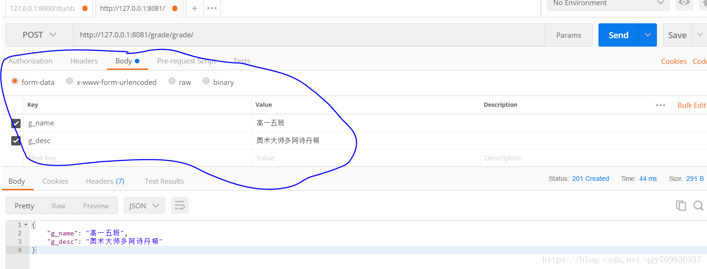

[TOC]

# 1. 模型的CURD

模型的CURD就简单的一下面几个方法进行介绍了, 本片主要是针对的django自带的ORM(objects relational mapping) -- 对象关系映射，翻译机， 介绍模型的CURD, 在介绍restful风格的时候， 会使用到mysql原生语句写api接口

- 创建(create)

  ```python
  # 第一种创建数据的方式
  article = Article()
  article.a_title = request.POST.get('title')
  article.a_content = request.POST.get('content')
  article.save()
  # 第二种创建数据的方式
  Article.objects.create(a_title=request.POST.get('title'),
                                 a_content=request.POST.get('content'))
  ```

  

- 更新(update)

  ```python
  # 更新可以查找到指定的一个进行更改
  user = Users.objects.get(pk=u_id)
  # 同样也可以进行批量更改， 使用all或者filter读取到多个数据进行修改
  Users.objects.all().update('想更改的字段及其值')
  user.u_can_use = not user.u_can_use
  user.save()
  ```

  

- 读取(read)

  ```python
  # 读取的方式有很多, 在这儿只举几个比较常见的
  users = Users.objects.all()  # 查询所有学生
  users = Users.objects.all().order_by('id')  # 查询所有学生并按照id进行升序排序
  users = Users.objects.filter(u_name='张三')  # 查找所有叫张三的学生
  users = User.objects.filter(u_name__startswith='张')  # 查询所有姓张的学生(大小写敏感)
  users = Users.objects.filter(u_name__contains='张')  # 名字中有张得所有学生
  users = Users.objects.filter(age__gte=18)  # 所有年龄大于等于18的学生  gt 则为大于
  users = Users.objects.filter(age__lte=18)  # 所有年龄小于等于18岁的学生 lt 则为小于
  users = User.objects.filter(age__in=[15, 19])  # 查询年龄为15, 19岁的学生
  users = User.objects.filter(age__range=(10，18))  # 查询年龄在10到18范围内的学生
  users = User.objects.get(id=1)  # 查询id等于1的学生
  # 注意：get和filter有区别， filter如果查找不到数据， 返回空， 而get会抛出异常
  users = User.objects.fiter(u_name__regex=r'^张.*?力$')  # 正则匹配查找以张开头，力结尾的学生(大小写敏感)  iregex(大小写不敏感)
  
  #+++++++++++++++++++++++++++++补充+++++++++++++++++++++++++++++++++++++++++++++++
  # Q(), F()
  # F() -- F()允许Django在未实际链接数据的情况下具有对数据库字段的值的引用。通常情况下我们在更新数据时需要先从数据库里将原数据取出后方在内存里，然后编辑某些属性，最后提交。
  # 例1
  # 常规操作：
  order = Order.objects.get(orderid='123456789')
  order.amount += 1
  order.save()
  
  # 使用F()方法：
  from django.db.models import F
  from core.models import Order
   
  order = Order.objects.get(orderid='123456789')
  order.amount = F('amount') - 1
  order.save()
  # 例2
  # 有一张表,保存着公司员工的工资,公司普涨工资，代码如下：
  from django.db.models import F
  UserInfo.objects.filter().update(salary=F('salary')+500)
  
  # Q() -- Q对象(django.db.models.Q)可以对关键字参数进行封装，从而更好地应用多个查询。可以组合使用 &（and）,|（or），~（not）操作符，当一个操作符是用于两个Q的对象,它产生一个新的Q对象。
  # 例
  # 代码
  Order.objects.get(
      Q(desc__startswith='Who'),
      Q(create_time=date(2016, 10, 2)) | Q(create_time=date(2016, 10, 6))
  )
  # 相应的SQL语句
  SELECT * from core_order WHERE desc LIKE 'Who%' AND (create_time = '2016-10-02' OR create_time = '2016-10-06')
  
  # 注：Q对象可以与关键字参数查询一起使用，不过一定要把Q对象放在关键字参数查询的前面
  # 例
  # 正确写法
  Order.objects.get(
      Q(create_time=date(2016, 10, 2)) | Q(create_time=date(2016, 10, 6))
      desc__startswith='Who',
  )
  # 错误写法
  Order.objects.get(
      desc__startswith='Who',
      Q(create_time=date(2016, 10, 2)) | Q(create_time=date(2016, 10, 6))
  )
  
  
  
  ```

  

- 删除(delete)

  ```python
  # 删除比较简单，找到想删除的几个数据， 例
  user = Users.object.get(pk=1)
  user.delete()
  ```

  

# 2.分页

## 2.1 django中自带的分页模块

```python
from django.core.paginator import Paginator

# 从前端页面获取要跳转页面的页数， 如果没有获取到page_id， 就默认为1
page_id = request.GET.get('page_id', '1')
users = Paginator(Users.object.all(), 10)  # 参数10是指每一页有10个数据
page = paginator.page(int(page_id))
# 将paginator和page通过接口或者其他可以传给前台的方式
```

 如果没有按照接口的方式传给前台， 在前台页面需要这样做:

```python

	# user是User()对象， 剩下的你懂得
      # 像这样

users.paginator.page_range # 总页数
users.number # 当前页数
users.has_next  # 是否有下一页
users.next_page_number  # 下一页
users.has_previous  # 是否有上一页
users.previous_page_number  # 上一页
```


## 2.2 分页插件django-pagination

这个分布插件很强大，配置也及其简单， 在这里就不详细介绍了， 大家有兴趣自己看官[官方文档](http://dj-pagination.readthedocs.io/en/latest/usage.html#usage%5D)

# 3.restful风格

## 3.1 rest-framework

### 3.1.1 配置 

这里就将开始使用到restful，在进行操作前，请先在当前虚拟坏境下安装下面的库：
```Python
pip install djangorestframework
pip install django-filter  # Filtering support
```

- 首先先配置好url
```Python
from rest_framework.routers import SimpleRouter

router = SimpleRouter()  # 实例化一个router
router.register('grade', views.GradeEdit)

urlpatterns += router.urls  # 添加进url

```
注意： register里面设置的url不能尾斜杠

- url写好了，记得在setting配置了，增加'rest_framework' app

- 之后写序列化的格式，在gradeapp里面建立一个serializers.py文件，代码如下：

```Python
from rest_framework import serializers

from grade.models import Grade, Major


class GradeSerializer(serializers.ModelSerializer):

    class Meta:
        model = Grade
        fields = ['g_name', 'g_desc']

```

- 最后开始序列化Grade的数据

在grade/views/文件中添加一下代码：
```Python
class GradeEdit(mixins.ListModelMixin,
                mixins.RetrieveModelMixin,
                mixins.CreateModelMixin,
                mixins.DestroyModelMixin,
                mixins.UpdateModelMixin,
                viewsets.GenericViewSet):
    # 查询所有序列信息
    queryset = Grade.objects.all()
    # 序列化
    serializer_class = GradeSerializer
```
写好这个类，增删改查的方法就写好了，和前几天的代码量相比，这个简洁了太多了
```Python
mixins.ListModelMixin  # 显示所有数据，也就类中的queryset里面的内容，当然是进过了序列化的内容

mixins.RetrieveModelMixin  # 查询， 通过id查询 get请求

mixins.CreateModelMixi  # 新建数据  post请求

mixins.DestroyModelMixin  # 删除数据  通过id(主键)进行删除数据

mixins.UpdateModelMixin  # 更新数据 patch请求(更新部分字段) put(请求更新全部字段)
```

准备完毕，这个时候进入到 localhost:8000/grade/grade/ 页面(根据自己的情况决定)


当然，最开始的时候数据肯定是空得，这个页面其实也就是所谓的接口了

### 3.1.2 postman

这里介绍的是一个企业级前后分离经常用到的软件，名字就叫做Postman

之后，我将在里面演示，通过Postman进行增删改查操作：

#### 1) 增加数据：



post请求添加数据

#### 2) 查询数据：


在url后面写要查询的数据的编号

#### 3) 删除数据：


同样通过编号删除数据，使用的delete请求

#### 4) 更新数据：


这里使用的是patch请求，put请求也可以，不过不再这里继续演示了

#### 5) 修改接口中数据的格式

对于接口数据显示的格式，在每个公司都可能不一样，所以在真正使用这些接口的时候，我们需要按照公司规定的接口格式返回数据

```Python
# 要想实现自定义的接口样式，我们需要重写rest_framework.renderers.JSONResponse类中的render方法
# 这个可以自己重新创建一个文件来保存
from rest_framework.renderers import JSONRenderer


class ResultJsonRender(JSONRenderer):

    def render(self, data, accepted_media_type=None, renderer_context=None):
        """
        在这里，我们想要的返回数据的格式为
        {
            'code': xxx   # 状态码,
            'msg':  ''   # 请求结果的文字描述，比如是否成功等,
            'data': '[]'  # 想要返回的数据,
            ...          # 有可能还有更多
        }
        """

        res = {'code': 200, 'msg': '请求成功！', 'data': data}

        return super().render(res, accepted_media_type, renderer_context)

# 重写完之后，我们还需要在settings中配置restframework

REST_FRAMEWORK = {
    # 验证当前用户的权限，如果权限不够，无法访问
    'DEFAULT_PERMISSION_CLASS': [
        'rest_framework.permissions.IsAdminUser',
    ],
    # 配置分页, 可以选择两种方式, 1. LimitOffsetPagination使用这种方式生成的url为...../?limit=xx&offset=xx
    # 现在国内教或的豆瓣电影网站接口就是采用的这种方式
    # 2. 就是我当前使用的方式，..../?page=xx
    # 当然如果你觉得这两种方式看着都不算，你也可以选择重写该类的某个方法，
    # 我在这里不再介绍怎样重写，你可以ctrl加右键点击进类里面，看原来的是怎样实现的
    
    'DEFAULT_PAGINATION_CLASS': 'rest_framework.pagination.PageNumberPagination',
    'PAGE_SIZE': 1,
    'DEFAULT_RENDERER_CLASSES': (
        'utils.resultAPI.ResultJsonRender',
    )
}
```

#### 6) api异常处理

通过反复的查看django-restframework中自带的定义异常的方式，我们可以用多种方式自定义抛出异常, 这里我只展示一种方法，就是在每个模型的增删该查方法中添加可能遇到的异常信息

```Python
class GradeEdit(mixins.ListModelMixin,
                mixins.CreateModelMixin,
                mixins.RetrieveModelMixin,
                mixins.UpdateModelMixin,
                mixins.DestroyModelMixin,
                viewsets.GenericViewSet):
    # 查询所有序列信息
    queryset = Grade.objects.all()
    # 序列化
    serializer_class = GradeSerializers

    def create(self, request, *args, **kwargs):
        # 重写create方法，主要是为了自定义异常信息
        if not request.data.get('g_name'):
            #在Django中，raise可以传递一个异常信息给APIException
            raise serializers.ValidationError({'g_name': '该字段不能为空!'})
        return super().create(request, *args, **kwargs)
   
```

```Python
# 当然， 自定了接口的返回数据，我们也需要在上面写的自定义的接口格式修改一下
# 旨在，当我们判断经过了自定义的异常信息后，数据中是否已经存在code, message的我们在规定接口格式中要求的键了

from rest_framework.renderers import JSONRenderer
from rest_framework.pagination import PageNumberPagination, LimitOffsetPagination


class ResultJsonRender(JSONRenderer):

    def render(self, data, accepted_media_type=None, renderer_context=None):
        """
        在这里，我们想要的返回数据的格式为
        {
            'code': xxx   # 状态码,
            'msg':  ''   # 请求结果的文字描述，比如是否成功等,
            'data': '[]'  # 想要返回的数据,
            ...          # 有可能还有更多
        }
        """
        # 判断data是否为字典格式，若为字典格式，那一定是因为在
        # 异常判断是除了问题，我已经把data返回的数据定义为了字典格式
        if not isinstance(data, dict):
            code = 200 if not renderer_context else renderer_context.status_code
            res = {'code': code, 'success': True, 'data': data}
        else:
            res = data
        return super().render(res, accepted_media_type, renderer_context)


```

在restframework的序列化模块中有一下几种异常

- ParseError  如果请求在访问request.data时， 包含了错误的数据就会抛出， 默认情况下，这个异常会生成一个状态码为400的异常
- AuthenticationFailed  当接受到的请求包含不正确的认证信息时抛出。默认情况下，这个异常会生成状态码401， 但是在某些时候亦有可能生成403 forbiden的异常，这取决与使用的身份验证方案
- NotAuthenticated  当一个未认证请求正在进行权限检查时抛出, 其他情况与AuthenticationFailed完全一致
- PermissionDenied  顾名思义就是权限不够的异常
- NotFound  404未找到页面
- MethodNotAllowed   当传入请求发生时，不会映射到试图上的处理程序方法
- NotAcceptable  当传入请求中的请求头不被任何的renderer满足时抛出
- UnsupportedMediaType   如果没有合适的parser用于解析请求的content type 类型时抛出， 默认人生成的响应对象状态为415 
- Throttled   在限流检查失败后抛出， 默认生成的响应对象状态码为429
- ValidationError  验证错误与其他APIException异常的区别:  
  - detail    必须有， 列表或者字典， 或者嵌套的数据结构。
  - 应该被用于序列化或者字段验证中， 所以在我们进行自定义异常的时候基本上可以使用他

### 3.1.3使用restframework自动生成接口文档 

#### 1) 准备工作

```python
pip install coreapi
pip install django-rest-swagger
```

#### 2) 配置

- 用Django自带的(界面比较丑)

  ```python
  # urls.py
  
  from rest_framework.documentation import include_docs_urls
  urlpatterns = [
      url(r"^docs/$", include_docs_urls(title="MY API DOCS")),
  ]
  ```

- 使用Django-rest-swagger

  ```python
  # settings.py 中
  
  INSTALLED_APPS = [
      ...
      'rest_framework_swagger',
      ...
  ]
  
  # urls.py
  
  from rest_framework_swagger.views import get_swagger_view
  
  schema_view = get_swagger_view(title="我的docs")
  
  urlpatterns = [
      url(r"^docs/$", schema_view),
  ]
  ```

## 3.2 自定义restful风格

像我在针对模型讲解的时候， 在模型类中添加了to_dict()方法， 这个方法便是为了我们能更容易的将我们查找出来的对象转化成字典形式， 方便我们以接口的方式将数据传给前端界面。

```python
def show_content(request, a_id):
    """展示文章内容页面"""
    if request.method == 'GET':
        if Article.objects.filter(pk=a_id).exists():
            article = Article.objects.get(pk=a_id)
            return JsonResponse({'code': '200', 'msg': '请求成功！', 'article': article.to_dict()})
        else:
            return JsonResponse(status_code.SHOW_CONTENT_ERROR)
```

在上述的代码实现中， 您会发现， 我在当如果没有查到article的时候返回的json数据，是调用的一个文件当中的SHOW_CONTENT_ERROR， 这种方式在实际开发中会经常用到， 将接口返回到错误状态都在一个文件中归档处理， 例如下面:

```python
OK = 200
SUCCESS = {'code': OK, 'msg': '请求成功！'}
DATABASE_ERROR = {'code': 0, 'msg': '数据库错误！请稍后重试！'}

# 用户模块
USER_REGISTER_DATA_NOT_NULL = {'code': '1001', 'msg': '请填写完整的参数！'}
USER_REGISTER_MOBILE_ERROR = {'code': '1002', 'msg': '手机号不正确！'}
USER_REGISTER_IS_NOT_COMMON_VALUE = {'code': '1003', 'msg': '两次输入的用户名密码不正确！'}
USER_REGISTER_ALREADY_EXISTS = {'code': '1004', 'msg': '该用户已经注册了！'}
USER_LOGIN_USER_INFO_ERROR = {'code': '1005', 'msg': '用户名密码错误！'}
USER_UPLOAD_IMAGE_ERROR = {'code': '1006', 'msg': '上传图片格式错误！'}

USER_AUTH_DATA_NOT_NULL = {'code': '1007', 'msg': '实名信息请填写完整！'}
USER_AUTH_ID_CARD_ERROR = {'code': '1008', 'msg': '无效身份证号！'}
USER_AUTH_ID_CARD_ALREADY_EXISTS = {'code': '1009', 'msg': '该身份证号已经被认证！'}

# 房屋模块
HOUSE_IMAGE_LOAD_ERROR = {'code': 1011, 'msg': '房屋图片格式无效，上传失败！'}
```

## 3.3 直接使用mysql原生语句完成restful风格

在使用mysql原生语句进行操作前， 我完全不反对大家使用django自带的orm框架， 但是我还是建议大家，在进行一些简答的操作时， 使用orm， 进行一些复杂的操作时可以选择使用下面的方式进行操作。

还有一种情况，当数据量极大的时候， 在我们可能需要对数据库进行优化的时候(为了加快数据的查询速度), 选择使用mysql原生语句不失为一种好方法。例如我们可以直接通过mysql语句对我们自己创建的试图进行访问， 这样会节省很多力气。

正好在这儿说到了mysql的试图， 那我就简答介绍一下吧

### 3.3.1 视图

- 1.视图是一张虚拟的表,他表示一张表的部分数据或多张表的综合数据,
- 视图的结构是建立在表的基础上
- 2.视图中没有数据,只有表结构,视图中的数据在基表中获取
- 3.一张表可以创建多个视图,一个视图可以引用多张表

#### 1) 创建视图

```python
create [or replace] view `视图名` as sql语句
```

```mysql
create view articleinfo as select a.id, a.create_time, a.update_time, a.a_title, a.a_content, a.hot_point, a.file, at.typename from article as a join article_type as at on at.id = a.type_id
# 创建一个已经关联好的articleinfo视图， 这个视图中包含了，article的所有字段， 也包含了article_type的typename字段
```

#### 2) mysql原始语句

```Python
# 创建好视图之后，由于视图这个表在模型层中是不存在的，所以在这里我们无法通过操作模型层来直接操作该表，这时我们就可以用到直接操作sql的操作来完成操作我们定义的视图表进行增删改查
from django.db import connection


def dict_fetchall(cursor):
    """
    将游标中的行以字典的形式返回
    :param cursor: 游标
    :return:  字典
    """
    desc = cursor.description
    return [
        dict(zip([col[0] for col in desc], row))
        for row in cursor.fetchall()
    ]


def show_content(request, a_id):
    """展示文章内容页面"""
    if request.method == 'GET':
        # 使用orm框架
        # if Article.objects.filter(pk=a_id).exists():
        #     article = Article.objects.get(pk=a_id)
        #     return JsonResponse({'code': '200', 'msg': '请求成功！', 'article': article.to_dict()})
        # else:
        #     return JsonResponse(status_code.SHOW_CONTENT_ERROR)

        # 使用orm框架与mysql结合
        # if Article.objects.filter(pk=a_id).exists():
        #     article = [a for a in Article.objects.raw('select * from article where id = %s', [a_id])][0]
        #     data = article.to_dict()
        #     data['a_content'] = markdown.markdown(data['a_content'])  # 将a_content通过markdown渲染成html页面
        #     return JsonResponse({'code': '200', 'msg': '请求成功！', 'article': data})
        # else:
        #     return JsonResponse(status_code.SHOW_CONTENT_ERROR)
        # 使用直接操作数据库的方法
        
        sql = 'select * from articleinfo where id = %s'
        with connection.cursor() as c:
            c.execute(sql, [a_id])  # 使用这种方法，而不是直接使用 '%s' % num 来写sql是为类防止sql注入攻击.
            data = dict_fetchall(c)
        data = data[0] if len(data) > 0 else None
        data['a_content'] = markdown.markdown(data['a_content'])
        return JsonResponse({'code': 200, 'msg': '请求成功！', 'article': data})
```

注意， 在上面使用到了with进行操作， 在这里的with相当于下面的操作

```Python
cursor = connection.cursor()
try:
    cursor.execute(sql)
except:
    cursor.close()
```

# 4. 中间件

中间件是插在Django的请求和响应过程中的框架。他是一种轻量级的低层插件系统, 用于全局调整Django的输入或输出

一个中间件组件专注做一件特定的事。例如， Django使用AuthenticationMiddleware这个中间件来处理待会话的请求

说到中间件，也不得不介绍一下AOP(面向切面)编程思想

## 4.1 AOP(面向切面)


